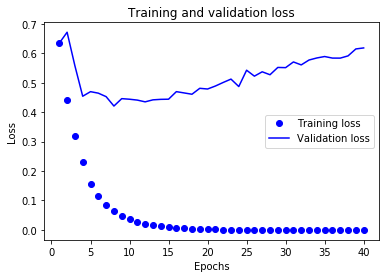
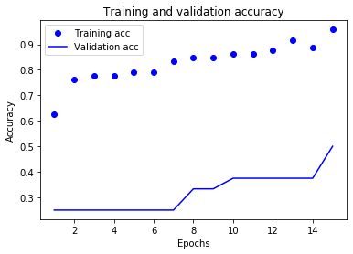

# article_classifier

네이버 뉴스에서 '정치', '경제' 부분 기사 수집, 형태소 분석 후  분류하는 모델을 DNN으로 구현했습니다.  

1. `selenium`, `BeautifulSoup` 을 이용하여 기사를 수집했습니다.
2. `konlpy`로 tokenizing하여 기사의 명사들만 추렸습니다. 
3. 하나의 기사마다 단어 500개를 선택하여 `one-hot encoding`했습니다.
4. `keras`를 이용하여 DNN로 분류 모델을 만들었습니다. 
5. test dataset을 이용하여 잘 분류하는지 판단해보았습니다. 


## Requirement
- Python 
- Tensorflow 
- keras
- BeautifulSoup
- selenium
- konply

___

### 1. 네이버 기사 수집
```
# -*- coding: UTF-8 -*- 
# [ IMPORT ] #
import pandas as pd
import numpy as np

import urllib.request
import requests
from bs4 import BeautifulSoup as bs
import pymysql
from  selenium import webdriver
from selenium.webdriver.common.keys import Keys
import time 
```
```
data = pd.DataFrame() 
data['article'] = None
data['label'] = None

# 네이버-정치 기사 스크래핑 정치 -> label =0, 2020-04-14, 2020-04-17

driver = webdriver.Chrome("크롬 드라이버 exe파일 경로를 넣어줍니다.") 
driver.get("https://news.naver.com/main/main.nhn?mode=LSD&mid=shm&sid1=100") # 네이버 뉴스 -정치 페이지 주소입니다. 
driver.implicitly_wait(5) # 크롬창이 열린 후 5초간 기다립니다. 

html = driver.page_source # 열린 페이지(네이버 뉴스- 정치)의 html 소스를 html에 넣습니다.
soup = bs(html, 'html.parser') # beautifulsoup으로 파싱합니다. 

links = [] # 뉴스 페이지에 있는 기사들의 주소를 담는 list입니다. 
for link in soup.findAll("a" , class_ = 'cluster_text_headline nclicks(cls_pol.clsart)'):
    links.append(link.attrs['href'])
links = np.array(links)


data_temp = pd.DataFrame() # 임시로 기사를 담을 데이터프레임입니다. 
data_temp = data_temp.append({'article':'','label':''}, ignore_index=True) # 데이터프레임에 칼럼 생성.
for i in range(0, len(links)):
    driver.get(links[i]) # links에 담은 기사들의 주소 페이지에 들어감.
    html = driver.page_source 
    soup = bs(html, 'html.parser')
    
    #article = clean_text(soup.find('div', class_ = '_article_body_contents').get_text())
    
    data_temp.iat[0,data.columns.get_loc('article')]= clean_text(soup.find('div', class_ = '_article_body_contents').get_text())
    data_temp.iat[0,data.columns.get_loc('label')] = 0
    
    data = data.append(data_temp, ignore_index = True)
    time.sleep(3) # 3초간 쉰다. 너무 빠르게 돌리면 사이트에서 크롤링을 감지하고 막을 수도 있다.(특히 구글)
    
   ``` 
 clean_text = 정규식 표현으로 불필요한 특수문자나 문구를 제거하는 함수를 정의하여 사용했다. 
 
 ```
 import re
def clean_text(text):
    cleaned_text = re.sub('[a-zA-Z]' , '', text)
    #cleaned_text = re.sub('[^0-9]',
                        #  '', cleaned_text)
    cleaned_text = re.sub('[\{\}\[\]\/?.,;:|\)*~`!^\-_+<>@\#$%&\\\=\(\'\"\【\】]',
                          '', cleaned_text)
    cleaned_text = re.sub('[\▲\ⓒ\n]',
                          '', cleaned_text)
    cleaned_text = re.sub('오류를 우회하기 위한 함수 추가',
                          '', cleaned_text)

    cleaned_text.lstrip() #왼쪽 공백 제거
    cleaned_text.rstrip() #오른쪽 공백 제거
    return cleaned_text
```

### 2. konlpy tokenizing

```
from konlpy.tag import Okt
from keras import preprocessing 
from keras.preprocessing.text import Tokenizer

okt = Okt()


data_token = pd.DataFrame()
data_temp = pd.DataFrame()
data_temp = data_temp.append({'article':'','label':''}, ignore_index=True)


for i in range(data.shape[0]):
    
    nouns = okt.nouns(data['article'][i]) # 명사만 추출
    
    data_temp.iat[0,data.columns.get_loc('article')] =  nouns
    data_temp.iat[0,data.columns.get_loc('label')] = data['label'][i]
    data_token = data_token.append(data_temp, ignore_index = True)
data_token

```

### 3. 빈도수가 높은 단어 선택 후 one-hot-encoding

```
from keras import preprocessing 
from keras.preprocessing.text import Tokenizer

tokenizer = preprocessing.text.Tokenizer(num_words=500) # 빈도수가 높은 단어 500개를 선택하도록 tokenizer 객체 생성
tokenizer.fit_on_texts(train_data)
X_train = tokenizer.texts_to_matrix(train_data, mode='binary') 
X_train
```
```
array([[0., 1., 1., ..., 0., 0., 0.],
       [0., 1., 1., ..., 0., 0., 0.],
       [0., 1., 1., ..., 0., 0., 0.],
       ...,
       [0., 1., 1., ..., 0., 0., 0.],
       [0., 1., 1., ..., 0., 0., 0.],
       [0., 1., 1., ..., 0., 1., 0.]])
```
       
### 4. DNN 모델링

```

try:
    # %tensorflow_version only exists in Colab.
    %tensorflow_version 2.x
except Exception:
    pass
import tensorflow as tf
import os

from keras import models
from keras import layers

model = models.Sequential()
     
model.add(layers.Dense(16, activation='relu', input_shape=(500,)) )  # 주요 단어 500개로 one-hot encoding -> input_shape 수 500개
model.add(layers.Dense(16, activation='relu'))
model.add(layers.Dense(1, activation='sigmoid' )) # '정치' '경제' 이진분류 -> sigmoid 사용. 

model.compile(optimizer='RMSProp',
              loss='binary_crossentropy', # 이진 분류 loss -> binary_crossentropy 사용
              metrics=['accuracy'])

history = model.fit(X_train,
                    y_train,
                    epochs=10,
                    shuffle= True, # 데이터 셋의 기사들을 섞어준다. 
                    batch_size=15,
                    validation_split=0.25)
```

plot을 이용하여 history확인

```
import matplotlib.pyplot as plt

acc = history.history['accuracy']
val_acc = history.history['val_accuracy']
loss = history.history['loss']
val_loss = history.history['val_loss']

epochs = range(1, len(acc) + 1)

# ‘bo’는 파란색 점을 의미합니다
plt.plot(epochs, loss, 'bo', label='Training loss')
# ‘b’는 파란색 실선을 의미합니다
plt.plot(epochs, val_loss, 'b', label='Validation loss')
plt.title('Training and validation loss')
plt.xlabel('Epochs')
plt.ylabel('Loss')
plt.legend()

plt.show()
```
  

```
plt.clf()   # 그래프를 초기화합니다
acc = history_dict['accuracy'][:15] # epochs 수랑 맞추기 위해서
val_acc = history_dict['val_accuracy'][:15]

plt.plot(epochs, acc, 'bo', label='Training acc')
plt.plot(epochs, val_acc, 'b', label='Validation acc')
plt.title('Training and validation accuracy')
plt.xlabel('Epochs')
plt.ylabel('Accuracy')
plt.legend()

plt.show()
```
  

### 5. test 데이터셋을 이용하여 평가

```
pred = model.predict(X_test) # X_test 데이터를 넣어서 예측한 값을 저장. pred는 확률로 나온다. 
count = 0

# 0 = 정치, 1= 경제
for i in range(len(pred)):
    if pred[i] < 0.5 :
        if y_test[i] == 0 :
            print('예측 값 : {}, 분류 예측 : {}, 정답 : {}'.format(pred[i], '정치', '정치' ))
            count += 1
        else: 
            print('예측 값 : {}, 분류 예측 : {}, 정답 : {}'.format(pred[i], '정치', '경제' ))
    if pred[i] > 0.5 :
        if y_test[i] == 0 :
            print('예측 값 : {}, 분류 예측 : {}, 정답 : {}'.format(pred[i], '경제', '정치' ))
        else: 
            print('예측 값 : {}, 분류 예측 : {}, 정답 : {}'.format(pred[i], '경제', '경제' ))
            count += 1
    
print('정답 갯수 : {}, 총 갯수 : {} '.format(count, len(pred)))
               
```


## 결론 

- 정치와 경제 뉴스는 비슷한 단어를 사용하는 경향이 있어서 분류가 어렵다.    
- 현재 상황(2020-04-15~2020-04-17)엔 선거와 코로나로 대부분의 기사가 선거와 코로나와 관련된 기사여서 분류에 어려움이 있다. 
- 데이터 수집을 많이하고, 모델 튜닝을 하고, 성격이 다른 뉴스 기사를 분류한다면 더 나은 성능이 나올 것이라고 생각한다.  
